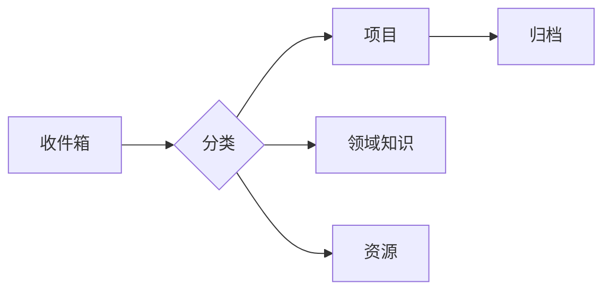

---
{"dg-publish":true,"permalink":"/Index/","title":"知识库主页","tags":["index","MOC","gardenEntry"]}
---

"Il faut imaginer Sisyphe heureux."

⌛您已使用 Obsidian 0 天 | ⌨️输入了 0 篇笔记 | 🖊输出了 0 篇笔记 | 📑读了 0 篇文献。

## 📚 快速导航

### 🎯 核心工作区

- [[00.inbox/README\|📥 收件箱]] - 快速捕捉想法
- [[10.projects/README\|🚀 当前项目]] - 进行中的项目
- [[60.daily/README\|📅 每日笔记]] - 今日工作记录

### 🧠 知识领域

- [[20.areas/运筹学/README\|运筹学]]
- [[20.areas/系统工程/README\|系统工程]]
- [[20.areas/决策分析/README\|决策分析]]
- [[20.areas/数据分析/README\|数据分析]]
- [[20.areas/信息管理/README\|信息管理]]

### 📖 学习资源

- [[30.resources/文献笔记/README\|📄 文献笔记]]
- [[30.resources/课程笔记/README\|📚 课程笔记]]
- [[30.resources/书籍笔记/README\|📕 书籍笔记]]
- [[30.resources/方法论/README\|🔬 方法论]]
- [[30.resources/工具使用/README\|🛠️ 工具使用]]

### 📔 个人空间

- [[70.journal/README\|📔 个人日志]] 
- [[70.journal/随笔/README\|✍️ 随笔]] 
- [[70.journal/读书感悟/README\|📚 读书感悟]] 
- [[70.journal/个人反思/README\|🪞 个人反思]] 
- [[70.journal/生活记录/README\|🌈 生活记录]]

### 🗄️ 其他
- [[40.archives/README\|📦 归档]] - 已完成项目
- [[50.templates/README\|📋 模板库]] - 各类模板

---

## 🔄 工作流程

### 日常使用流程
1. **捕捉** - 在 [[00.inbox/README\|收件箱]] 快速记录想法
2. **整理** - 定期将笔记分类到对应文件夹
3. **关联** - 使用双向链接建立知识网络
4. **回顾** - 通过 [[60.daily/README\|每日笔记]] 复盘总结

---

## 📝 最近更新

- 2026-01-23: 知识库框架初始化

---

## 💡 使用提示

- 使用 `Ctrl/Cmd + O` 快速打开文件
- 使用 `[[]]` 创建双向链接
- 使用 `#标签` 进行分类
- 定期回顾和整理笔记
